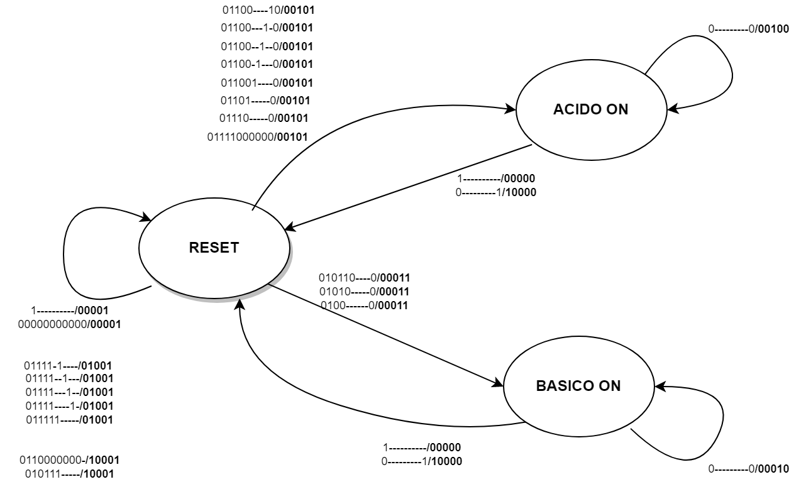

\newpage

# FSM (final state machine):

Viene riportato il il grafico delle transizioni del controllore.
Il controllore in questione avra' 3 stati:

- **RESET**: Reset sara' lo stato iniziale della macchina e rimarra in questo stato fino a che non verra' forinto un input con il secondo bit (START) a 1, in ogni altro caso lo stato rimarra' a reset. Inoltre da qualsiasi stato ci si trovi se viene fornito un input con il primo bit (RST) a 1  lo stato tornera' a RESET e tutti gli output verranno azzerati.

- **BASICO ON**: Lo stato di BASICO ON viene raggiunto quando viene dato in input START e un valore di pH acido, quindi  minore di 7 e maggiore di 0. Al cambio di stato da RESET a BASICO ON viene fornito al datapah il segnale DPSTART, lo stato tornera' in RESET una volta ricevuto il segnale DPEND dal datapah che porta il controllore al suo stato iniziale di RESET. Quando la fsm entra in questo stato il quarto bit di output (VALVOLA BASICO) viene attivato e rimane attivo fino al termine delle operazioni del datapath.
 

- **ACIDO ON**: Lo stato di ACIDO ON viene raggiunto quando viene dato in input un pH basico quindi quando il pH dato in input e' maggiore di 9 e minore di 14. Al cambio di stato da quello iniziale viene mandato il segnale DPSTART al datapath per farlo iniziare a lavorare. Quando la fsm entra in questo stato il terzo bit (VALVOLA ACIDO) viene attivato e rimmane attivo fino al termine delle operazioni del datapath

La FSM inizialmente si trovra' in stato di RESET e vi rimarra' fino a quando non ottiene un segnale in input con: il primo bit (RESET) a 0, il secondo bit (START) a 1, e un valore di pH valido, quindi maggiore uguale 0 e minore uguale 14, la FSM rimarrà in stato di RESET anche se viene dato in input un valore compreso tra 7 e 8. Nel caso venga inserito un pH maggiore di 14 viene attivato il secondo bit di output (ERRORE_SENSORE). 
Una volta ottenuto in input un valore valido la FSM mandera' il segnale DPSTART al datapath e la fsm rimarrà ferma fino a quando il datapath non comunica che ha finito di lavorare inviando il segnale DPEND. Durante la permanenza nello stato di ACIDO_ON o BASICO_ON verrà attivato l'output della relativa valvola (terzo bit per acido e quarto bit per basico) per segalare all'utente le operazioni in esecuzione, il segnale viene disattivato una volta ricevuto il segnale DPEND dal datapath.
L'output del sistema rimane a 0 negli ultimi 16 bit (PH_FINALE + NCLK) fino a quando il datapath non ha terminato, quando termina il segnale primo bit di output (FINE_OPERAZIONE) viene attivato e viene messo in output il valore neutro della soluzione e il numero di cicli di clock necessari per far diventare neutra la soluzione

