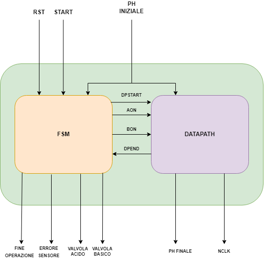

\newpage

# Schema generale

## Input:

- **RST [1 bit]**: questo segnale servira' a resettare la macchina, quando viene alzato questo ingresso la macchina passa da qualsiasi stato fosse precedentemente a quello di RESET e porta tutti i bit dell'output a 0.

- **START [1 bit]**: questo segnale da inizio alla elaborazione e una volta messo a 1 la macchina leggera' il pH in input.

- **PH [8 bit]**: il segnale del pH iniziale e' formato da 8 bit codificato in fixed-point in cui 4 bit per la parte intera e 4 bit per la parte decimale

## Segnali fsm e datapath:

 - **DPSTART [1 bit]**: Questo segnale serve al Controllore per comunicare al datapath di iniziare a lavorare e utilizzare il pH dato dall'input e non quello contenuto nel suo registro. Questo segnale viene alzato solo al cambiamento di stato, al ciclo successivo viene abbassato per permettere al datapath di utilizzare il dato salvato nel registro

- **AONBON [2 bit]**: Questo segnale serve al Controllore per segnalare quale valvola aprire, se acida o basica.

- **DPEND [1 bit]**: Questo segnale e' utilizzato dal datapath per segnalare la fine dell'esecuzione e permettergli di cambiare stato.

## Output:

- **FINE_OPERAZIONE [1 bit]**: Questo output viene attivato quando il datapath ha finito di lavorare e la soluzione, quindi, e' stata portata ad uno pH neutro.

- **ERRORE_SENSORE [1 bit]**: Il segnale di errore sensore viene utilizzato quando viene dato in input un valore per il pH non valido.

- **VALVOLA_ACIDO [1 bit]**: Questo output serve a segnalare quale valvola viene aperta dal macchinario per portare la soluzione a un pH neutro.

- **VALVOLA_BASICO [1 bit]**: Come l'output precedente segnala l'utilizzo di una soluzione basica per portare ad un pH neutro

- **PH_FINALE [8 bit]**: Questo output avra' segnale con tutti i bit a 0 finche il macchinario non termina le operazioni, una volta terminate fornisce il pH della soluzione neutra ottenuta. Il pH sara' codificato in fixed-point con 4 bit per l'intero e 4 per la parte decimale come nell'input

- **NCLCK [8 bit]**: Questo output ritorna il numero di cicli di clock che sono stati necessari per portare la soluzione iniziale a neutra