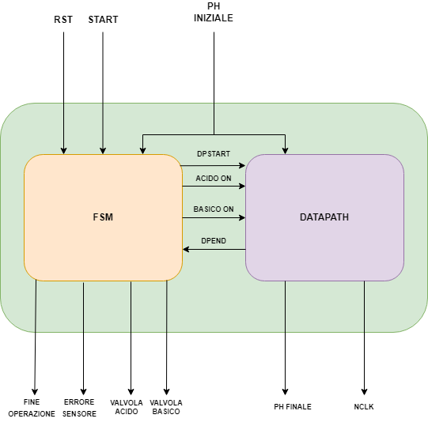

\newpage

# Schema generale



## Input: {.unlisted .unnumbered}

- **RST[1]**: questo segnale, alzato a `1`, servirà a resettare il circuito, portando tutti gli output a `0`.

- **START[1]**: questo segnale, alzato a `1`, da inizio alla elaborazione del pH in input.

- **PH[8]**: il pH iniziale.

## Output: {.unlisted .unnumbered}

- **FINE_OPERAZIONE[1]**: Questo output viene alzato a `1` quando la soluzione è stata portata ad avere un pH neutro.

- **ERRORE_SENSORE[1]**: Il segnale di errore sensore viene alzato a `1` quando il pH in input  ha un valore valido.

- **VALVOLA_ACIDO[1]**: segnala, se uguale a `1`, che la valvola della soluzione acida è stata aperta dal macchinario per portare la soluzione a un pH neutro.

- **VALVOLA_BASICO[1]**: segnala, se uguale a `1`, che la valvola della soluzione basica è stata aperta dal macchinario per portare la soluzione a un pH neutro.

- **PH_FINALE[8]**: Questo output avrà segnale con tutti i bit a 0 fino a che il macchinario non termina le operazioni, una volta terminate fornisce il pH della soluzione neutra ottenuta.

- **NCLK[8]**: Questo output ritorna il numero di cicli di clock che sono stati necessari per portare la soluzione iniziale a neutra.

## Segnali fsm e datapath: {.unlisted .unnumbered}

 - **DPSTART[1]**: segnale di output della fsm che viene ricevuto dal datapath, se alzato a `1` indica l'inizio dell'elaborazione.
  
- **ACIDO ON[1]**: segnale di output della fsm che viene ricevuto dal datapath, indica se la valvola acida è aperta se valorizzato a  `1`

- **BASICO ON[1]**: segnale di output della fsm che viene ricevuto dal datapath, indica se la valvola basica è aperta se valorizzato a  `1`

- **DPEND[1]**: segnale di output dal datapath (`normalizer.blif`) che viene ricevuto in ingresso dalla fsm, decreta la fine della normalizzazione.

## Funzionamento
Una volta avviato il circuito dall'entry point `FSMD.blif`, per iniziare l'elaborazione è necessario fornire in ingresso il bit di **RESET** a `0`, **START** alzato a `1` seguito dal pH di 8bit.
Ricevuto l'input, l'fsm valuterà se il pH è di tipo **acido** o **basico**, inviando al datapath i segnali di **ACIDO ON**, **BASICO ON** e **DPSTART**. Esempio:
```bash
sim 0 1 1 0 0 1 0 0 0 0 # start e ph = 9
```
Il datapath inizierà quindi l'elaborazione del pH, producendo in output tutti `0`, fino a che la soluzione non sarà **normalizzata**. Una volta finito, il datapath invierà il segnale **DPEND** alla fsm che cambierà stato producendo in output il segnale di **FINE OPERAZIONE** e abbassando **ACIDO ON**/**BASICO ON**.
Il segnale **DPEND** viene usato anche dal datapath per produrre in output il valore ottenuto del pH ed il numero di cicli di clock necessari. \newline
Di seguito un esempio di output normalizzato

